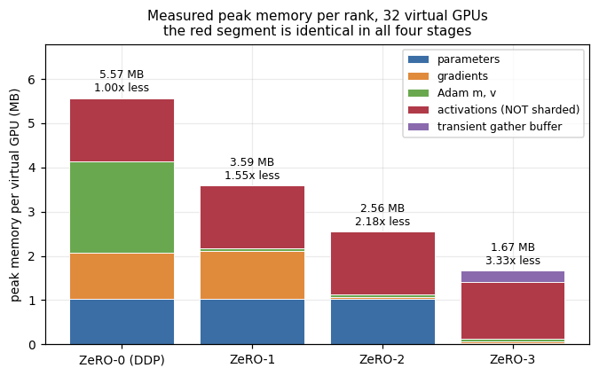
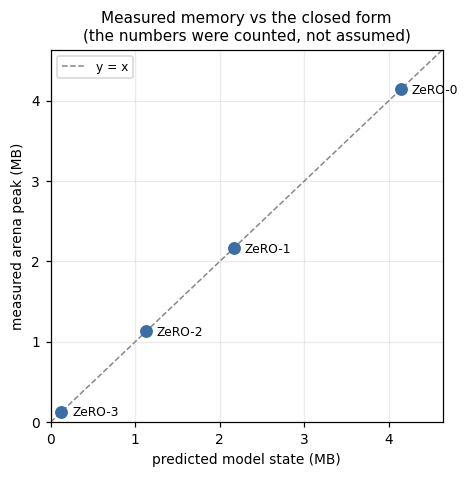
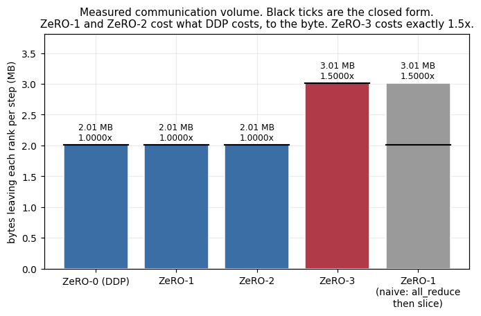
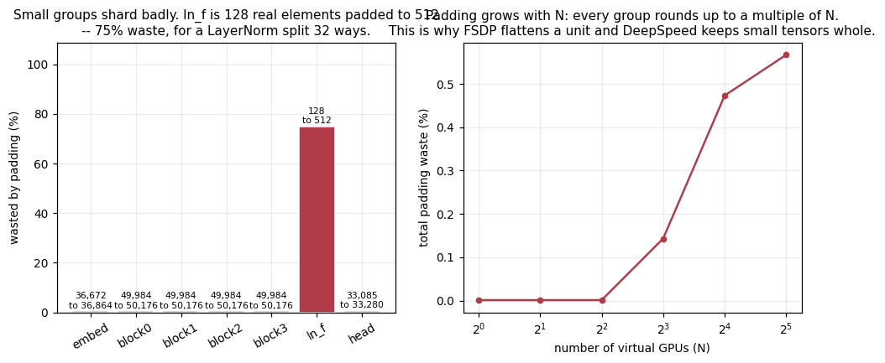
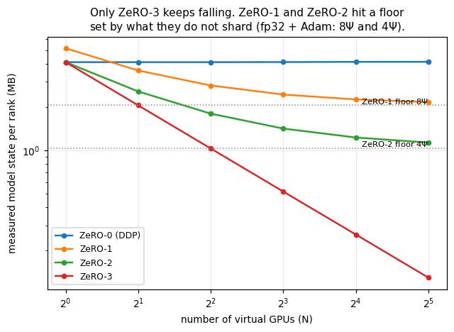
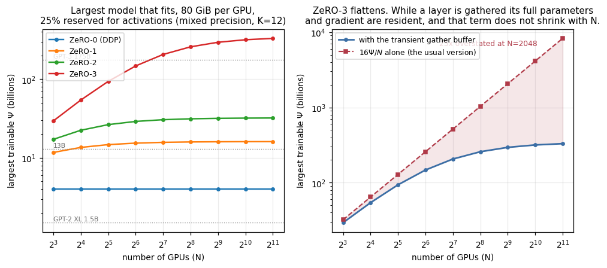
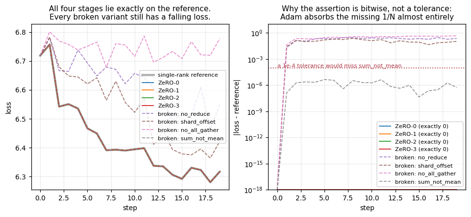

# ZeRO-1, ZeRO-2 and ZeRO-3 on 32 virtual GPUs

32 virtual GPUs made from CPU threads. A small transformer trains on them 4 ways: normal data
parallel, then ZeRO stages 1, 2 and 3. Every memory and network number is **measured**, not
estimated.

**Notebook:** [`zero_32_virtual_gpus.ipynb`](zero_32_virtual_gpus.ipynb) ·
**Numbers:** [`results/metrics.csv`](results/metrics.csv) ·
**Repo:** https://github.com/LokeshJatangi/Distributed-Training-Mock

> **Notation:** **Ψ** (psi) = number of parameters in the model. **N** = number of GPUs.
> So "16Ψ" means 16 bytes per parameter, and "16Ψ/N" means that split across N GPUs.

---

## 1. The problem

Train on 4 GPUs. Each gets different data, computes gradients, they average, everyone updates.

The catch: **every GPU stores the whole model state.**

GPT-2 XL, 1.5B parameters, mixed precision + Adam:

| what | size |
|---|---|
| fp16 weights | 3 GB |
| fp16 gradients | 3 GB |
| fp32 master weights | 6 GB |
| Adam `m` | 6 GB |
| Adam `v` | 6 GB |
| **total** | **24 GB** |

- That's **16 bytes per parameter** → written as **16Ψ**.
- Doesn't fit on a 16 GB card. And that's before activations exist.
- **18 of those 24 GB are identical on every GPU.** Add a 33rd GPU → still 18 GB each.
- So data parallelism buys speed and **zero** memory.

---

## 2. What ZeRO does

Stop copying the same thing 32 times. Split it. Rebuild only when needed.

| Stage | Splits | Per-GPU (N=32) | Network cost |
|---|---|---|---|
| ZeRO-0 (DDP) | nothing | 16Ψ | 1× |
| **ZeRO-1** | optimizer (`m`, `v`) | 8.25Ψ | **1×** |
| **ZeRO-2** | + gradients | 4.4Ψ | **1×** |
| **ZeRO-3** | + weights | 0.5Ψ | **1.5×** |

- ZeRO-3: each GPU keeps **1/32 of every weight**.
- Needs a layer → asks the other 31 for their pieces → uses it → frees it.

---

## 3. Why ZeRO-1 and ZeRO-2 are free

The natural guess: DDP sends 1 message, ZeRO-1 sends 2, so ZeRO-1 must cost more.

It doesn't, because **DDP's "one message" is already two.**

An all-reduce is literally:

```
step 1  reduce-scatter  -> each GPU ends up owning the sum of one slice
step 2  all-gather      -> pass slices around until everyone has all of them
```

- ZeRO-1 does **the same two steps**.
- Only difference: step 2 carries *updated weights* instead of *summed gradients*.
- Same number of elements → same bytes.
- ZeRO-2 changes **no** message at all. It just frees gradients earlier.

**Measured:** `2,103,040` bytes per GPU per step for ZeRO-0, ZeRO-1 **and** ZeRO-2 — the same
integer, not "roughly the same".

> **Takeaway:** ZeRO-2 costs what DDP costs and uses 3.66× less memory. There's no good reason
> to run plain DDP when ZeRO-2 is available.

---

## 4. Why ZeRO-3 costs 1.5×

- ZeRO-3 frees weights after the forward pass.
- Backward needs them again → **fetch twice**.
- 3 steps instead of 2 → **exactly 1.5×**. Measured `3,154,560` bytes = `1.5000×`.
- True for every N, not just 32.

**Worth it?** Usually yes — 50% more network for 8.75× less memory than ZeRO-2.

**And 1.5× is a setting, not a law.** Keep the weights resident between forward and backward and
it drops back to 1×. That's `reshard_after_forward` in PyTorch FSDP.

---

## 5. Results

Model: Ψ = `269,821` parameters (padded to `271,360`, so `8,480` per GPU), 32 virtual GPUs.

### Memory and network

| Mode | Model state / GPU | vs DDP | Network / GPU / step | vs DDP |
|---|---|---|---|---|
| ZeRO-0 | `4,341,760` B | 1.00× | `2,103,040` B | 1.0000× |
| ZeRO-1 | `2,272,640` B | 1.91× | `2,103,040` B | 1.0000× |
| ZeRO-2 | `1,187,200` B | 3.66× | `2,103,040` B | 1.0000× |
| ZeRO-3 | `135,680` B | **32.00×** | `3,154,560` B | **1.5000×** |



Each stage removes exactly the piece it claims to: Adam's state, then gradients, then weights.

### Important: activations don't shard

- ZeRO splits **weights, gradients, optimizer state**. That's all.
- Activations (values saved during the forward pass) are untouched: `1,495,428` bytes,
  **identical in all 4 modes and on all 32 GPUs**.
- So model state dropped **32.00×**, but real peak memory dropped only **3.33×**.
- The fix for activations is activation checkpointing — a separate technique, not ZeRO.




### Padding: small layers shard badly

- Every group is padded up to a multiple of N so it divides evenly.
- The final LayerNorm is `128` numbers. Split 32 ways with padding → `512`. **75% waste.**
- Whole model is only 0.57% wasted, because the transformer blocks dominate — but the ratio
  gets worse as N grows.
- Real libraries have a setting for this (DeepSpeed's `stage3_param_persistence_threshold`
  leaves small tensors unsharded).



### Scaling with more GPUs



- ZeRO-1 and ZeRO-2 **flatten out**. They have a floor (8Ψ and 4Ψ) set by what they don't
  split. More GPUs won't get you below it.
- Only ZeRO-3 keeps falling. That's the real argument for stage 3.



**Biggest model that fits**, 80 GiB per GPU, 25% held back for activations, mixed precision:

| N | ZeRO-0 | ZeRO-1 | ZeRO-2 | ZeRO-3 |
|---|---|---|---|---|
| 8 | 4.0B | 11.7B | 17.2B | 29.5B |
| 32 | 4.0B | 14.7B | 26.4B | 93.7B |
| 64 | 4.0B | 15.4B | 29.0B | 147.3B |
| 512 | 4.0B | 16.0B | 31.8B | 294.5B |

One term matters here that's easy to leave out: while a layer is gathered, its full weights
*and* its gradient are live, and that **doesn't shrink with N**. Its size is set by the biggest
group (`50,176` elements here), not by Ψ/N. Leave it out and the table claims 8 trillion
parameters at N=2048; include it and the answer is 330 billion.

---

## 6. Is it correct?

**All 4 modes give bit-for-bit identical answers.** Not "close" — `max|delta| = 0.000e+00`
across 54 tensors, and identical to a single-GPU reference too.

That's possible because of two design choices:

- `all_reduce` is **built as** reduce-scatter + all-gather, so ZeRO-0 adds the same numbers in
  the same order as ZeRO-1/2/3.
- Adam works element-by-element, so running it on a slice equals running it on the whole tensor
  and looking at that slice.

**All 32 validation checks pass.**

### Four bugs planted on purpose

A test that has never failed isn't proof it can fail. So four deliberate bugs ship with the
tests:



| Bug | Loss error | Loss still fell? | Caught by |
|---|---|---|---|
| correct code | **0.000e+00** | — | — |
| `no_reduce` — never sync gradients | 2.886e-01 | yes | normal tolerance |
| `shard_offset` — update slice off by one | 2.373e-01 | yes | normal tolerance |
| `no_all_gather` — never rebuild weights | 4.613e-01 | no | normal tolerance |
| `sum_not_mean` — forget to divide by 32 | **4.455e-06** | yes | **only the bit-exact check** |

> **Three broken versions still lowered the loss.** A falling loss curve proves nothing on its own.

`sum_not_mean` is nearly invisible because Adam divides by the gradient's own magnitude — make
every gradient 32× bigger and it mostly cancels out. Under plain SGD the same bug would be a 32×
learning rate and an instant blow-up.

---

## 7. Checked against real PyTorch

`torchrun --nproc_per_node=4` on the gloo backend, **same model code on both sides**.

| | world = 1 | world = 4 |
|---|---|---|
| this ZeRO-0 vs real DDP | 9.537e-07 ✅ | 5.960e-07 ✅ |
| this ZeRO-3 vs real FSDP2 | 9.537e-07 ✅ | 4.768e-07 ✅ |
| **real DDP vs real FSDP2** | 0.000e+00 ✅ | 9.537e-07 ✅ |

- **This implementation's DDP matches PyTorch's DDP.** That single check validates the threads,
  the collectives, the model and the data pipeline all at once.
- FSDP2 **does** run on CPU/gloo — the common advice that FSDP needs NCCL is out of date.
- At both world sizes, ZeRO-3's loss curve agrees with FSDP2 within the `1e-3` comparison
  tolerance. The largest observed difference is `9.537e-07`.

**What can be claimed:** ZeRO-0 is checked against PyTorch DDP; ZeRO-3's loss curve is checked
against FSDP2. All four modes are checked bitwise against the single-GPU reference and each other.

> This compares *numbers*, not *bytes*. gloo has no true reduce-scatter — it runs a full
> all-reduce and copies out one chunk — so gloo byte counts would contradict correct maths.

---

## 8. What's measured and what isn't

**Measured on this machine:**
- per-GPU memory, broken down by weights / gradients / optimizer / activations
- bytes moved per collective, and how many collectives per step
- loss curves and parameter values

**Calculated from formulas** (and asserted equal to the measurements where both exist):
- the 16Ψ accounting, per-stage memory, communication volume
- the biggest-model-that-fits table

**Not claimed at all:**
- **Speed.** 32 Python threads on 12 cores measure Python's interpreter lock, not ZeRO. There is
  deliberately no timing chart anywhere in this repo.
- **Real network behaviour.** A collective here is a memory copy. Byte counts are real; times
  are not.

**Scope limits:**
- Runs in fp32, not mixed precision, so the measured ratios are the more conservative ones. The
  paper's headline numbers are reproduced by formula.
- Ψ = `269,821`, five orders of magnitude below a production model.
- N = 32 is the only world size measured end to end, apart from the sweep figure.

The formulas reproduce the ZeRO paper's Table 1 exactly — 120 / 31.4 / 16.6 / 1.88 GB at
Ψ = 7.5B, and 2048 / 536 / 284 / 32 GB at 128B.

---

## 9. Run it

**Colab** — click, then Runtime → Run all. About 2 minutes; a CPU runtime is fine:

https://colab.research.google.com/github/LokeshJatangi/Distributed-Training-Mock/blob/main/zero_32_virtual_gpus.ipynb

**Local** (verified with Python 3.12 and PyTorch 2.9.1):

```bash
git clone https://github.com/LokeshJatangi/Distributed-Training-Mock.git
cd Distributed-Training-Mock
python3.12 -m venv .venv && .venv/bin/pip install -r requirements.txt

.venv/bin/python -m pytest tests/ -q                 # 15 unit tests
.venv/bin/python scripts/make_results.py --steps 20  # figures + results
OMP_NUM_THREADS=1 .venv/bin/torchrun --nproc_per_node=4 scripts/torch_crosscheck.py
```

The notebook already has its outputs saved, so you can read it without running anything.

---

## 10. Files

```
zero_32_virtual_gpus.ipynb   the notebook, outputs included

vzero/
  vgpu.py         counts bytes per virtual GPU, keyed by storage address so
                  views cost nothing. Every memory number depends on this.
  fabric.py       the collectives. all_reduce is BUILT from reduce_scatter +
                  all_gather, which is what makes the bit-exact claims work.
                  Two versions, proven identical: a real 31-step ring, and a
                  faster path for the training runs.
  shard.py        how Psi parameters become 32 slices, including padding.
  model.py        a transformer with no nn.Module -- with one, weights always
                  exist and ZeRO-3 can't be demonstrated honestly.
  optim.py        Adam on a slice. Element-wise, which is half the bit-exact
                  proof.
  engine.py       the 4 modes and the single-GPU reference.
  accounting.py   activation memory, measured rather than estimated.
  analysis.py     formulas only, no measurement, so the notebook can compare
                  predicted against measured.
  validate.py     the 32 assertions and the 4 planted bugs.
  report.py       figures. Contains no timing plot, on purpose.
  pool.py         worker threads. One rank crashing fails all 32 immediately
                  instead of 32 separate timeouts.

scripts/
  make_results.py      regenerates figures/ and results/
  torch_crosscheck.py  real DDP and FSDP2 under torchrun
  build_notebook.py    generates the .ipynb, so code is never copy-pasted
  check_readme.py      checks every number in this file against results/

tests/     15 tests, including "a mismatched rank must crash, not hang"
figures/   committed, so GitHub renders them without running anything
results/   metrics.csv, summary.json, crosscheck-world{1,4}.json
```

Build notes — the PyTorch behaviours this implementation had to work around, and why certain
design choices were forced — are in
[`IMPLEMENTATION-NOTES.md`](IMPLEMENTATION-NOTES.md).

---

## Sources

All paper numbers were read from the papers, not recalled.

| Paper | Link | Used for |
|---|---|---|
| ZeRO | [1910.02054](https://arxiv.org/abs/1910.02054) | the 3 stages, Table 1, the 1× / 1.5× claims |
| PyTorch FSDP | [2304.11277](https://arxiv.org/abs/2304.11277) | `reshard_after_forward` |
| ZeRO-Offload | [2101.06840](https://arxiv.org/abs/2101.06840) | mentioned only |
| ZeRO-Infinity | [2104.07857](https://arxiv.org/abs/2104.07857) | mentioned only |
| ZeRO++ | [2306.10209](https://arxiv.org/abs/2306.10209) | mentioned only |
| Activation checkpointing | [1604.06174](https://arxiv.org/abs/1604.06174) | the activations problem |
| Megatron-LM | [1909.08053](https://arxiv.org/abs/1909.08053) | tensor parallelism contrast |
| PyTorch DDP | [2006.15704](https://arxiv.org/abs/2006.15704) | gradient bucketing |
| Adam | [1412.6980](https://arxiv.org/abs/1412.6980) | the optimizer, and its scale invariance |

Ring all-reduce: Patarasuk & Yuan, JPDC 69(2), 2009 (no arXiv entry).

The distributed cross-checks were run with PyTorch 2.9.1. Relevant implementation files are
`ProcessGroupGloo.cpp` for gloo's reduce-scatter and `_fsdp_init.py` / `_fsdp_collectives.py`
for FSDP2's CPU paths.
